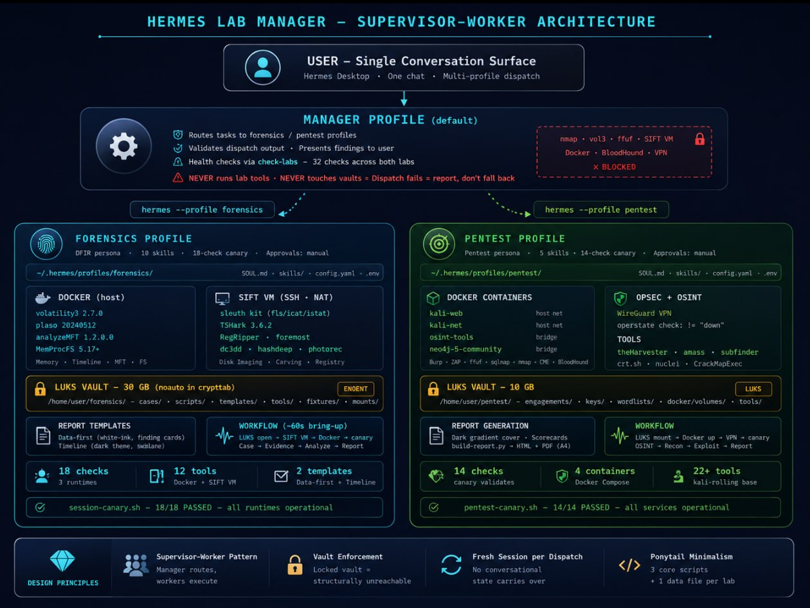

# Hermes Lab Manager

> **Multi-profile AI orchestration for digital forensics & penetration testing** — two labs, one Linux machine, zero context pollution.

### Why This Exists

Running two separate terminal windows — one for forensics, one for pentesting — gives you tools but not context. Each Hermes profile carries its own SOUL (persona), skills, memory, and model config. The forensics profile thinks like a DFIR analyst. The pentest profile thinks like a red teamer. They don't share conversational state, don't load each other's tools, and can't access each other's encrypted vaults. The manager bridges them through one conversation surface.

[](https://jayelbotvibe-web.github.io/hermes-lab-manager/)
[](https://htmlpreview.github.io/?https://github.com/jayelbotvibe-web/hermes-lab-manager/blob/main/index.html)
[](https://github.com/NousResearch/hermes-agent)
[](#profile-system)
[](#health-check)

---

## What This Is

A **supervisor-worker pattern** for [Hermes Agent](https://github.com/NousResearch/hermes-agent) that routes forensic and pentesting tasks from one conversation surface to two specialized AI profiles — each with its own persona, skills, tools, and encrypted storage.

```
You: "analyze this pcap"
  → Manager checks health → dispatches to forensics profile → presents findings

You: "OSINT on example.com"
  → Manager checks health → dispatches to pentest profile → presents subdomains
```

No switching profiles. No typing commands into the right window. One conversation surface.

> **📖 [View the full interactive reference →](https://jayelbotvibe-web.github.io/hermes-lab-manager/)** — dark-theme single-page site with architecture diagrams, tool inventory, vault system, dispatch patterns, pitfall registry, and 10-step replication guide. Also [viewable via HTMLPreview](https://htmlpreview.github.io/?https://github.com/jayelbotvibe-web/hermes-lab-manager/blob/main/index.html).

---

## 🚨 Hard Routing Rule

The **default profile never runs lab tools**, starts containers, or checks targets. All lab work is dispatched:

```bash
hermes -z "<self-contained prompt>" --profile forensics   # DFIR
hermes -z "<self-contained prompt>" --profile pentest     # Pentesting
```

**Dispatch fails? Report the failure.** Do not fall back to direct execution. Vaults make this structural: templates and scripts live behind LUKS — locked vault = ENOENT.

---

## Architecture



**Pattern:** Supervisor (Orchestrator-Worker) — one of four proven multi-agent patterns. Each `hermes -z` boots the profile fresh. No conversational state carries between dispatches.

---

## System Specs

| Component | Detail |
|-----------|--------|
| CPU | Intel i7-11800H (8C/16T) |
| RAM | 30 GB |
| Storage | 468 GB NVMe SSD |
| OS | Ubuntu 24.04+ |
| Hermes | v0.17.0 |
| Docker | latest stable |
| VMware | Workstation 17.x |

---

## Forensics Lab

**12 tools across 3 runtimes** — validated by 18-check canary on every session start.

| Runtime | Tools |
|---------|-------|
| Docker (host) | volatility3 2.7.0, plaso 20240512, analyzeMFT 1.2.0.0, MemProcFS 5.17+ |
| SIFT VM (SSH) | Sleuth Kit, TShark, RegRipper, foremost, dc3dd, hashdeep, photorec, ddrescue |

**SIFT VM:** VMware NAT (vmnet8), static IP `<SIFT-VM-IP>`. Bridged WiFi causes DHCP drift — NAT is the fix.

**Bring-up:** `bash /home/user/forensics/scripts/forensics-up.sh` — LUKS → SIFT VM → Docker → canary (~60s).

**Reports:** Two templates — `data-first-report.html` (white+ink, 01–10 sections, finding cards, client-ready) and `timeline-report.html` (dark theme, visual swimlane). Generated from structured JSON.

→ [Full forensics lab docs](https://github.com/jayelbotvibe-web/hermes-forensics-lab)

---

## Pentest Lab

**4 Docker containers + WireGuard VPN** — validated by 14-check canary.

| Service | Purpose |
|---------|---------|
| `kali-web` | Web app testing (Burp, ZAP, ffuf, sqlmap) |
| `kali-net` | Network scanning (nmap, masscan, crackmapexec) |
| `osint-tools` | OSINT (theHarvester, amass, subfinder) |
| `neo4j` | BloodHound graph database |

**VPN:** WireGuard → <VPN-provider>. Detection pitfall: `operstate` is `"unknown"`, not `"up"` — check `!= "down"`.

**Reports:** Dark gradient cover · 4-category scorecards · findings heatmap · A4 print-native.

→ [Full pentest lab docs](https://github.com/jayelbotvibe-web/hermes-pentest-lab)

---

## Profile System

Three Hermes profiles, each with independent SOUL, skills, memory, and `.env`:

| Profile | Role | Tool Access |
|---------|------|-------------|
| `default` | Manager — routes tasks, validates output | Terminal, file, web (NO lab tools) |
| `forensics` | DFIR worker | Docker vol3/plaso/MFT, MemProcFS, SIFT VM SSH |
| `pentest` | Pentest worker | Docker kali-web/net/osint/neo4j, VPN |

Profiles sandbox `$HOME` — always use absolute paths.

---

## LUKS Vault System

| Vault | File | Size | Mount | Purpose |
|-------|------|------|-------|---------|
| Forensics | `/home/user/forensics.img` | 30 GB | `/home/user/forensics/` | Cases, scripts, templates, evidence |
| Pentest | `/home/user/pentest-vault.img` | 10 GB | `/home/user/pentest/` | Engagements, keys, wordlists, Docker volumes |

Forensics vault uses `noauto` in `/etc/crypttab` — only mounts via `forensics-up.sh`. When locked, templates and scripts are **structurally unreachable** (ENOENT). This is the enforcement mechanism — the default profile cannot touch what isn't on the filesystem.

---

## Dispatch

```bash
# Lightweight (~60s) — canaries, single-phase tasks
hermes -z "Run canary and report pass/fail." --profile forensics

# Full engagement (8–12 min) — MUST use background
# Foreground has 600s hard limit
hermes -z "Run full pentest engagement against example.com..." --profile pentest
```

**Prompt checklist:** absolute paths · canary first · scope boundaries · output request · keep it brief (worker skills fill in the workflow).

---

## Health Check

```bash
bash /home/user/.hermes/scripts/check-labs
```

One command, both canaries. Forensics: 18 checks across 3 runtimes. Pentest: 14 checks. Degraded tools marked for triage-only.

---

## Folder Layout

| Path | What | Gate |
|------|------|------|
| `~/.hermes/profiles/forensics/` | Forensics profile | None |
| `~/.hermes/profiles/pentest/` | Pentest profile | None |
| `~/.hermes/scripts/check-labs` | Health check | None |
| `~/.hermes/skills/devops/lab-manager/` | Manager skill | None |
| `/home/user/forensics/` | LUKS mount — all forensics | Keyfile |
| `/home/user/forensics/templates/` | Report templates | Vault mount |
| `/home/user/forensics/scripts/` | Automation scripts | Vault mount |
| `/home/user/pentest/` | LUKS mount — all pentest | Keyfile |
| `/home/user/pentest-repo/` | Git-tracked scripts/skills | None |

---

## Related Repos

| Repo | Purpose |
|------|---------|
| [hermes-forensics-lab](https://github.com/jayelbotvibe-web/hermes-forensics-lab) | Forensics worker — Docker tools, SIFT VM, MemProcFS, reports |
| [hermes-pentest-lab](https://github.com/jayelbotvibe-web/hermes-pentest-lab) | Pentest worker — Docker containers, VPN, reports |
| [hermes-lab-dashboard](https://github.com/jayelbotvibe-web/hermes-lab-dashboard) | Boot flow, tray launcher, architecture diagram |
| [Hermes Agent](https://github.com/NousResearch/hermes-agent) | The AI agent framework this all runs on |
| [SETUP.md](SETUP.md) | 10-step replication guide — bare metal to working dispatch |
| [PITFALLS.md](PITFALLS.md) | 13 proven pitfalls — BUG/FIX/DESIGN registry |

---

## Quick Start (after setup)

```bash
check-labs                                    # Verify both labs
hermes -z "Run canary. Analyze /path/to/dump. Use MemProcFS." --profile forensics
hermes -z "Run canary. OSINT on example.com. Zero packets." --profile pentest
```
